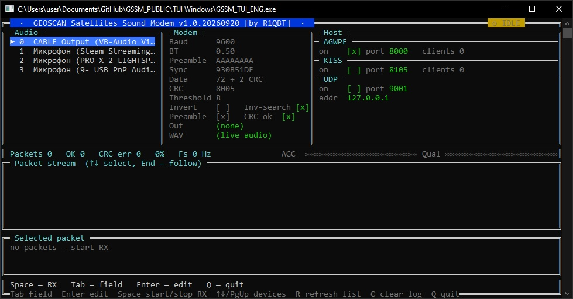
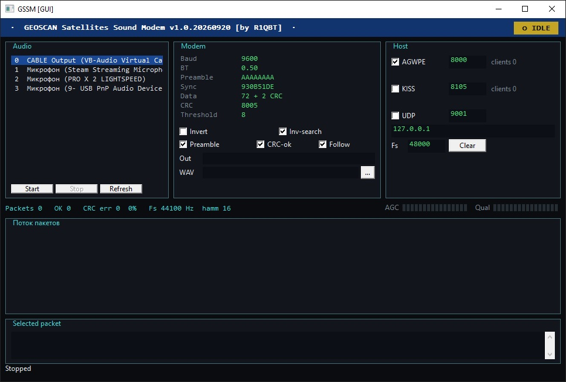

# GEOSCAN Satellites Sound Modem

Soundmodem для декодирования пакетного **GFSK 9600** Geoscan Framing.

## Запуск

```text
gssm                 GUI или TUI
gssm --help
```

### TUI (Windows + Linux)



| Клавиша | Действие |
|--------|----------|
| Tab / Shift-Tab, ← → | Поля настроек |
| Enter | Правка поля или переключение флага |
| Space | Старт / стоп приёма |
| ↑ ↓ | Устройство или пакет в логе |
| End | Следить за новыми пакетами |
| R | Обновить список устройств |
| C | Очистить лог |
| Q / Esc | Выход |

Параметры можно менять только на паузе.

### GUI (Windows)




### CLI

Список устройств:

```text
gssm --list
```

Живой приём с устройства `0`, запись кадров:

```text
gssm --device 0 --out packets.bin
```

Декодирование WAV (моно PCM, например AF из SDR#):

```text
gssm --wav capture.wav --out packets.bin
```

Только кадры с верным CRC:

```text
gssm --wav capture.wav --crc-only --out packets.bin
```

### Параметры кадра и модема

| Флаг | По умолчанию | Смысл |
|------|----------------|--------|
| `--rate` | 48000 | Желаемая частота дискретизации карты |
| `--no-inv-search` | — | Не искать инверсный SYNC |
| `--crc-only` | — | В файл и на хост только CRC-ok |
| `--out` | — | Бинарный дамп кадров |
| `--agw` / `--no-agw` | AGW вкл | TCP AGWPE |
| `--agw-port` | 8000 | Порт AGWPE |
| `--kiss` / `--no-kiss` | выкл | TCP KISS |
| `--kiss-port` | 8105 | Порт KISS |
| `--udp host:port` | выкл | UDP RAW |
